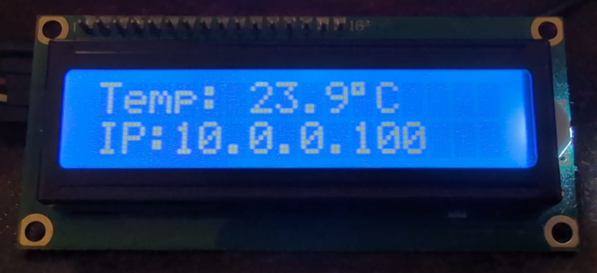
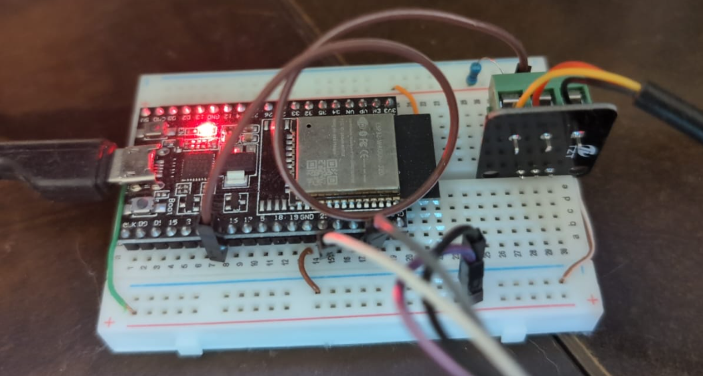

# ESP32 Temperature Monitor with Web Config

Este proyecto para ESP32 permite:

- Medir la temperatura con un sensor DS18B20
- Mostrar la temperatura en una pantalla LCD I2C (16x2)
- Visualizar y configurar la red Wi-Fi y nombre del dispositivo desde un portal web
- Enviar la temperatura a un servidor remoto mediante HTTP GET

## 🧰 Requisitos

- Placa ESP32
- Sensor de temperatura DS18B20
- Pantalla LCD I2C 16x2 (dirección: `0x27`)
- Librerías Arduino:
  - WiFi
  - WebServer
  - Preferences
  - Wire
  - LiquidCrystal_I2C
  - OneWire
  - DallasTemperature
  - HTTPClient

## 📦 Instalación de librerías

Asegúrate de instalar las siguientes librerías desde el Gestor de Bibliotecas de Arduino IDE:

- `LiquidCrystal_I2C` (por Frank de Brabander u otro compatible)
- `DallasTemperature`
- `OneWire`

## 🔧 Uso

1. **Primera vez / sin Wi-Fi guardado**  
   El dispositivo creará una red Wi-Fi llamada `ESP32_Config`. Conéctate a ella y accede a `http://192.168.4.1/` para configurar SSID, contraseña y nombre del dispositivo.

2. **Modo normal**  
   Se conecta a la red configurada, mide la temperatura y la muestra en la pantalla LCD, además de exponer una interfaz web en la IP local.

3. **Enviar temperatura a servidor remoto**  
   La temperatura se envía automáticamente cada ~5 segundos vía HTTP GET a:
- `https://temperature.yourdomain.com/insert.php?id=ID_DEL_DISPOSITIVO&temp=VALOR`

## 🌐 Interfaz Web

- Página principal (`/`): Muestra temperatura, ID del dispositivo, IP.
- Página de configuración (`/configuracion`): Requiere usuario `admin` y contraseña (por defecto `admin`, modificable).

## 🔐 Seguridad

- Configuración protegida con autenticación básica.
- Contraseña del administrador se puede cambiar desde el formulario web.

## 📝 Licencia

Este proyecto está licenciado bajo la licencia MIT. Ver archivo `LICENSE`.

## 📸 Capturas de pantalla

